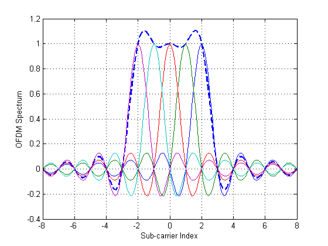
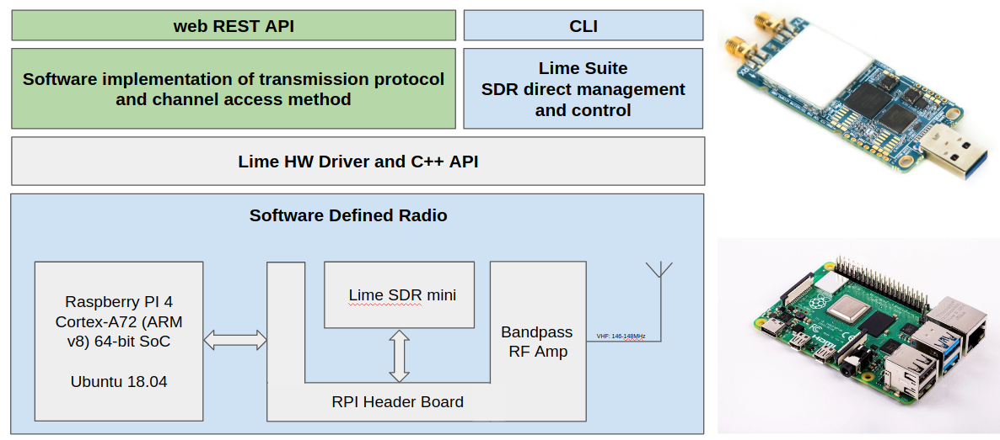
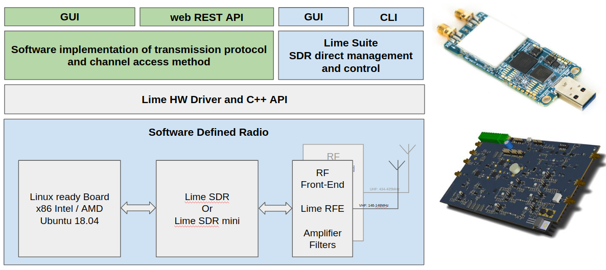

<table border="0">
 <tr>
    <td align="center"></td>
    <td>
    <b>Bernhard Isemann</b>  
        AT: OE3BIA 
        NL: PA3BI   
        Web: <a href="https://outofband.info">www.outofband.info</a> 
        </td>
        <td align="center">
          
        
    </td>
 </tr>
</table>

<h1>Overview</h1>
Development and operation of an emergency radio communication system is a newly enforced duty of the Radio Amateurs in Austria and reason for the need to establish a new digital transmission procedure allowing high speed data communication in Sub-GHz Frequency bands.  
Requirements for the new communication system are to use a wideband transmission mode to support more bandwidth for each user, and enables multiple users at the same time to connect to a base station.
The implementation of a new digital communication system will be based on the concept of a software defined radio using the LimeSDR ecosystem. This will address and motivate a larger community of developers and radio amateurs to get involved in the enhancement of the system. 
Hardware and software design of a base station and CPE-like user device shall allow a modular use with different radio front-ends supporting all possible Sub-GHz frequency bands.  
The Austrian Radio Amateur Association (OeVSV) together with the Institute of Telecommunication of the Vienna University of Technology will request a permit to test operation of such a new digital communication system in VHF and UHF frequency bands. A possible cooperation with The German Radio Amateur Association shall be explored for utilizing the new transmission protocol in German UHF bands.  

<h1>Goals</h1>
<ul>
<li>Evaluate and select appropriate wireless communication protocol similar to existing Wireless LAN protocols but suitable for the VHF and UHF bands.</li>
<li>Define a new transmission protocol for wideband data communication for efficient use of the a 2Mhz spectrum in the VHF band and suitable to operate an emergency data communication network connecting end-user devices to base stations.</li>
<li>Software development and implementation of the transmission protocol on a prototype SRD hardware for a base station and end users devices using the GNU Radio ecosystem.</li>
<li>Test and evaluation the new transmission protocol in lab- and field environments on selected Radio Amateur Relay locations in Austria.</li>
<li>Benchmark how reliability and scalability such a new transmission protocol can be operated in the VHF and UHF band.</li>
<li>Provide a blueprint for industrial development and production of base stations and end-user devices for the new transmission protocol.</li>
</ul>

<h1>Concept Modem</h1>

<h1>Concept Access Point</h1>

