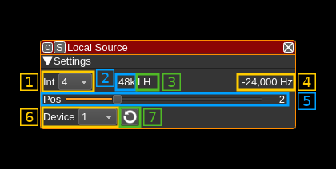

<h1>Local source channel plugin</h1>

<h2>Introduction</h2>

This plugin draws I/Q samples from a Local Output plugin device sink in another device set into the baseband. It is basically the same as the Remote Source channel plugin but pipes the samples internally instead of receiving them over the network.

It may be used when you want to use a particular sub area of the baseband for madulation.

Note that because it uses only the channelizer half band filter chain to achieve interpolation and center frequency shift you have a limited choice on the center frequencies that may be used (similarly to the Remote Source). The available center frequencies depend on the baseband sample rate, the channel interpolation and the filter chain that is used so you have to play with these parameters to obtain a suitable center frequency and pass band.

<h2>Interface</h2>

<h3>1: Interpolation factor</h3>

The device baseband can be interpolated from the channel and its center can be selected with (5). The resulting sample rate of the I/Q stream pulled from the Local Output device sink is the baseband sample rate divided by this value. The value is displayed in (2).

<h3>2: I/Q stream sample rate</h3>

This is the sample rate in kS/s of the I/Q stream pulled from the Local Output device sink instance.

<h3>3: Half-band filters chain sequence</h3>

This string represents the sequence of half-band filters used in the interpolation. Each character represents a filter type:

  - **L**: lower half-band
  - **H**: higher half-band
  - **C**: centered

<h3>4: Center frequency shift</h3>

This is the shift of the channel center frequency from the device center frequency. Its value is driven by the device sample rate, the interpolation (1) and the filter chain sequence (5).

<h3>5: Half-band filter chain sequence</h3>

The slider moves the channel center frequency roughly from the lower to the higher frequency in the device baseband. The number on the right represents the filter sequence as the decimal value of a base 3 number. Each base 3 digit represents the filter type and its sequence from MSB to LSB in the filter chain:

  - **0**: lower half-band
  - **1**: centered
  - **2**: higher half-band

<h3>6: Local Output source index</h2>

This selects the index of the Local Output device sink from which to pull the I/Q samples. The list can be refreshed with the next button (7)

<h3>7: Refresh local output devices list</h2>

Use this button to refresh the list of Local Output device sinks indexes.
