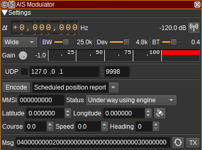

<h1>AIS modulator plugin</h1>

<h2>Introduction</h2>

This plugin can be used to transmit AIS (Automatic Identification System) messages using GMSK/FM modulation. AIS is used to track ships and other marine vessels at sea.

You need an AIS license to transmit on the AIS VHF frequencies (161.975MHz and 162.025MHz). This plugin should not therefore be used on those frequencies unless the transmitter and receiver are directly connected via coax. If you have an amateur license, you should be able to transmit AIS within amateur bands.

<h2>Interface</h2>

<h3>1: Frequency shift from center frequency of transmission</h3>

Use the wheels to adjust the frequency shift in Hz from the center frequency of transmission. Left click on a digit sets the cursor position at this digit. Right click on a digit sets all digits on the right to zero. This effectively floors value at the digit position. Wheels are moved with the mousewheel while pointing at the wheel or by selecting the wheel with the left mouse click and using the keyboard arrows. Pressing shift simultaneously moves digit by 5 and pressing control moves it by 2.

<h3>2: Channel power</h3>

Average total power in dB relative to a +/- 1.0 amplitude signal generated in the pass band.

<h3>3: Channel mute</h3>

Use this button to toggle mute for this channel.

<h3>4: Mode</h3>

Allows setting of RF bandwidth, FM deviation and BT values according to the chosen mode, which can be Narrow (BW=12.5kHz, Dev=2.4k, BT=0.3) or Wide (BW=25kHz, Dev=4.8k, BT=0.4). The latest specification for AIS, ITU-R M.1371-5, only specifies Wide operation.

<h3>5: RF Bandwidth</h3>

This specifies the bandwidth of a LPF that is applied to the output signal to limit the RF bandwidth. Typically this should be 25kHz.

<h3>6: FM Deviation</h3>

This specifies the maximum frequency deviation. Typically this should be 4.8kHz, giving a modulation index of 0.5 at 9,600 baud.

<h3>7: BT Bandwidth</h3>

Bandwidth-time product for the Gaussian filter, used for GMSK modulation. This should typically be 0.4.

<h3>8: Gain</h3>

Adjusts the gain in dB from -60 to 0dB. The gain should be set to ensure the level meter remains below 100%.

<h3>9: Level meter in %</h3>

  - top bar (beige): average value
  - bottom bar (brown): instantaneous peak value
  - tip vertical bar (bright red): peak hold value

<h3>10: UDP</h3>

When checked, a UDP port is opened to receive messages from other features or applications that will be transmitted. These messages do not need to contain the CRC, as it is appended automatically.

<h3>11: UDP address</h3>

IP address of the interface open the UDP port on, to receive messages to be transmitted.

<h3>12: UDP port</h3>

UDP port number to receive messages to be transmitted on.

<h3>13: Encode</h3>

When pressed, the message field will be set to a hex encoded string that represents the message determined by the following controls.

<h3>14: Message Type</h3>

Select a message type:

   - Scheduled postion report
   - Assigned position report
   - Special position report
   - Base station report

<h3>15: MMSI</h3>

Enter a 9 digit Maritime Mobile Service Identity, which uniquely identifies a vessel.

<h3>16: Status</h3>

For position reports, specify the status of the vessel.

<h3>17: Latitude</h3>

Specifiy the latitude of the vessel or station in decimal degrees, North positive.

<h3>18: Longitude</h3>

Specifiy the longitude of the vessel or station in decimal degrees, East positive.

<h3>19: Insert position</h3>

Sets the latitude and longitude fields to the values specified under Preferences > My position.

<h3>20: Course</h3>

For position reports, specify the vessel's course in degrees. This is the direction in which the vessel is moving.

<h3>21: Speed</h3>

For position reports, specify the vessel's speed in knots.

<h3>22: Heading</h3>

For position reports, specify the vessel's heading. This is the direction the vessel is pointing towards.

<h3>23: Message</h3>

The AIS message send. This should be a hex encoded string.

<h3>24: Repeat</h3>

Check this button to repeatedly transmit a message. Right click to open the dialog to adjust the delay between retransmission and number of times the message should be repeated.

<h3>25: TX</h3>

Transmits the message.

<h2>API</h2>

Full details of the API can be found in the Swagger documentation. Here is a quick example of how to transmit a message from the command line:

    curl -X POST "http://127.0.0.1:8091/RPX100/deviceset/1/channel/0/actions" -d '{"channelType": "AISMod",  "direction": 1, "AISModActions": { "tx": { "data": "000000000000000000000000000000000" }}}'

Or to set the FM deviation:

    curl -X PATCH "http://127.0.0.1:8091/RPX100/deviceset/1/channel/0/settings" -d '{"channelType": "AISMod", "direction": 1, "AISModSettings": {"fmDeviation": 4800}}'
