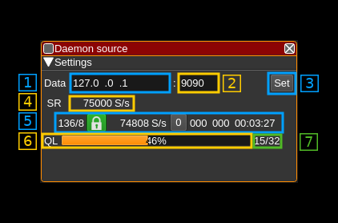

<h1>Remote source channel plugin</h1>

<h2>Introduction</h2>

This plugin receives I/Q samples from UDP and copies them to the baseband to be transmitted by the sink output device. It uses rpx-100 remote format and possible FEC protection.

<h2>Build</h2>

The plugin will be built only if the [CM256cc library](https://github.com/f4exb/cm256cc) is installed in your system. For CM256cc library you will have to specify the include and library paths on the cmake command line. Say if you install cm256cc in `/opt/install/cm256cc` you will have to add `-DCM256CC_DIR=/opt/install/cm256cc` to the cmake commands.

<h2>Interface</h2>

<h3>1: Data local address</h2>

IP address of the local network interface from where the I/Q samples are fetched via UDP

<h3>2: Data local port</h2>

Local port from where the I/Q samples are fetched via UDP

<h3>3: Validation button</h3>

When the return key is hit within the address (1) or port (2) the changes are effective immediately. You can also use this button to set again these values.

<h3>4: Stream sample rate</h3>

Stream sample rate as specified in the stream meta data. Interpolation may occur to match the baseband sample rate. This will be done around the baseband center frequency (no NCO shift). Decimation is not provisionned so unpredictable results may occur if the remote stream sample rate is larger than the baseband sample rate.

To minimize processing an exact match of baseband sample rate and remote stream sample rate is recommended. If this is not possible then a power of two ratio is still preferable.

<h3>5: Stream status</h3>

<h4>5.1: Total number of frames and number of FEC blocks</h4>

This is the total number of frames and number of FEC blocks separated by a slash '/' as sent in the meta data block thus acknowledged by the distant server. When you set the number of FEC blocks with (4.1) the effect may not be immediate and this information can be used to monitor when it gets effectively set in the distant server.

A frame consists of 128 data blocks (1 meta data block followed by 127 I/Q data blocks) and a variable number of FEC blocks used to protect the UDP transmission with a Cauchy MDS block erasure correction.

Using the Cauchy MDS block erasure correction ensures that if at least the number of data blocks (128) is received per complete frame then all lost blocks in any position can be restored. For example if 8 FEC blocks are used then 136 blocks are transmitted per frame. If only 130 blocks (128 or greater) are received then data can be recovered. If only 127 blocks (or less) are received then none of the lost blocks can be recovered.

<h4>5.2: Stream status</h4>

The color of the icon indicates stream status:

  - Green: all original blocks have been received for all frames during the last polling timeframe (ex: 136)
  - No color: some original blocks were reconstructed from FEC blocks for some frames during the last polling timeframe (ex: between 128 and 135)
  - Red: some original blocks were definitely lost for some frames during the last polling timeframe (ex: less than 128)

<h4>5.3: Actual stream sample rate</h4>

This is the sample rate calculated using the counter of samples between two consecutive polls

<h4>5.4: Reset events counters</h4>

This push button can be used to reset the events counters (5.5 and 5.6) and reset the event counts timer (5.7)

<h4>5.5: Unrecoverable error events counter</h4>

This counter counts the unrecoverable error conditions found (i.e. 4.4 lower than 128) since the last counters reset.

<h4>5.6: Recoverable error events counter</h4>

This counter counts the unrecoverable error conditions found (i.e. 4.4 between 128 and 128 plus the number of FEC blocks) since the last counters reset.

<h4>5.7: events counters timer</h4>

This HH:mm:ss time display shows the time since the reset events counters button (5.4) was pushed.

<h3>6: Transmitter queue length gauge</h3>

This is ratio of the reported number of data frame blocks in the remote queue over the total number of blocks in the queue.

<h3>7: Transmitter queue length status</h3>

This is the detail of the ratio shown in the gauge. Each frame block is a block of 127 &#x2715; 126 samples (16 bit I or Q samples) or 127 &#x2715; 63 samples (24 bit I or Q samples).
