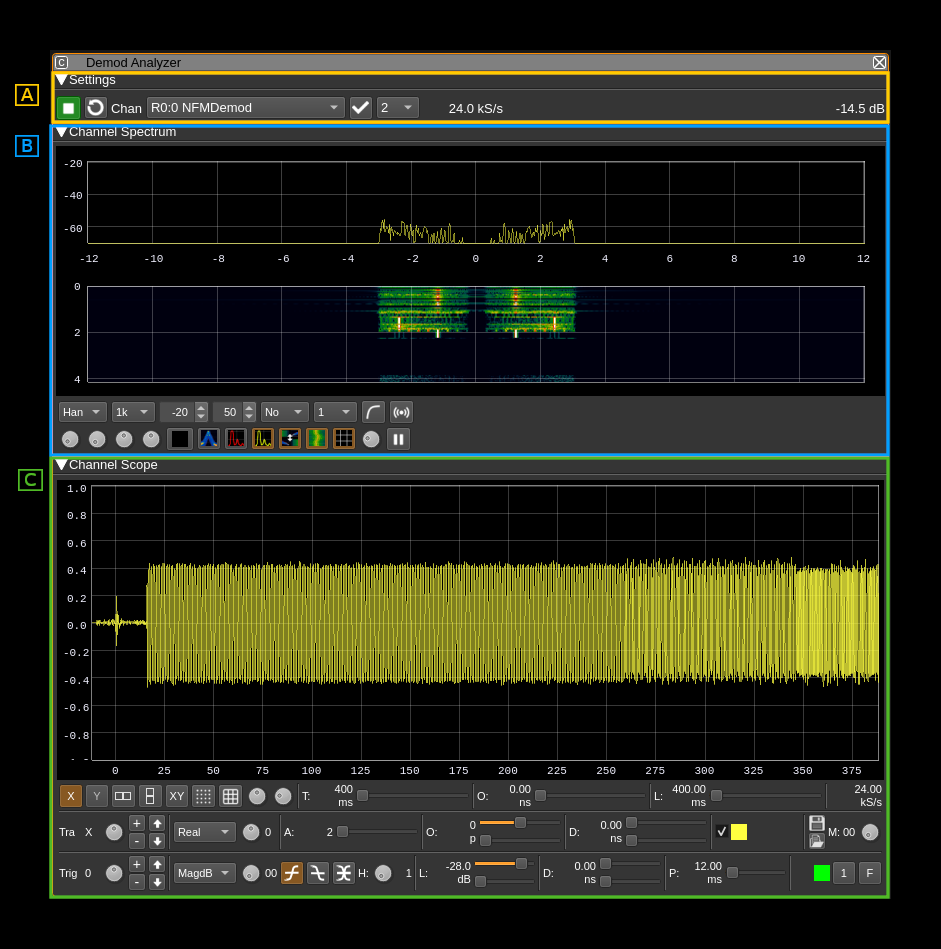

<h1>(De)modulator Analyzer plugin</h1>

<h2>Introduction</h2>

This plugin can be used to analyze the real demodulated signal from some Rx channel plugins. It can also be used to view the modulating signal of some Tx channel plugins.

Rx plugins are:

  - AIS demodulator
  - AM demodulator
  - DAB demodulator
  - DSD (FM digital voice) demodulator
  - NFM demodulator
  - Packer demodulator
  - SSB demodulator
  - WFM demodulator

Tx plugins are:

  - AIS modulator
  - AM modulator
  - NFM modulator
  - Packet modulator
  - SSB modulator
  - WFM modulator

<h2>General interface</h2>

The interface is essentially divided in the following sections

  - A. Channel controls
  - B. Spectrum view
  - C. Scope view

<h2>A. Channel controls</h2>

Typical sequence of operations:

  1. Start the plugin (A.1)
  2. Scan for displayable channels (A.2)
  3. Select channel (A.3)
  4. If channel is unique or default selection has not been changed press the (re)apply button (A.4)

<h3>A.1: Start/Stop plugin</h3>

This button starts or stops the plugin

<h3>A.2: (Re)scan available channels</h3>

Use this button to scan for channels available for display (see list of channel types in introduction)

<h3>A.3: Channel selection</h3>

Use this combo to select which channel to use for display. Channel is selected upon change. If channel is not changed or there is only one in the list you have to use the (re)apply button (A.4) to effectively connect the channel to the analyzer.

<h3>A.4: (Re)apply channel selection</h3>

Applies or re-applies channel selection (A.3) so that the channel gets effectively connected to the analyzer and signal is displayed. This will update the sample rate.

<h3>A.5: Decimation by a power of two</h3>

This combo can select half-band decimation from baseband sample rate by a power of two.

<h3>A.6: Analyzer sample rate</h3>

This is the resulting sample rate after possible decimation that is used by the spectrum and scope visualizations

<h3>A.7. Channel power</h3>

Average total power in dB relative to a +/- 1.0 amplitude signal received in the pass band.

<h2>B. Spectrum view</h2>

This is the same display as with the channel analyzer spectrum view. This is the spectrum of a real signal so it is symmetrical around zero frequency. See Channel Analyzer plugin documentation for details.

<h2>C. Scope view</h2>

This is the same display as with the channel analyzer scope view. Input is a real signal so imaginary part is always zero and some display are not relevant (phase and frequency displays). See Channel Analyzer plugin documentation for details.
