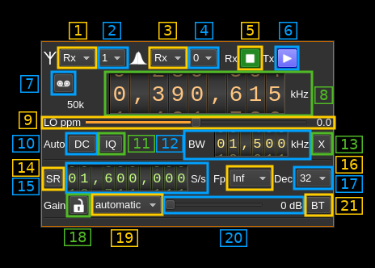

<h1>BladeRF 2.0 micro (v2) MIMO plugin</h1>

<h2>Introduction</h2>

This MIMO plugin sends and receives its samples to/from a [BladeRF2 device](https://www.nuand.com/bladerf-2). It handles both input (Rx) and output (Tx) streams synchronously. There is no option to synchronize Rx with Tx streams.

<h2>Build</h2>

As with other BladeRF plugins this plugin will be built only if the [BladeRF host library](https://github.com/Nuand/bladeRF) is installed in your system. If you build it from source and install it in a custom location say: `/opt/install/libbladeRF` you will have to add `-DBLADERF_DIR=/opt/install/libbladeRF/include` to the cmake command line.

Note that libbladeRF v2 with git tag 2018.10-rc1 should be used (official release) thus:

  - The FX3 firmware version should be v2.3.1
  - The FPGA image version should be v0.9.0

The FPGA .rbf file should be copied to the folder where the `rpx-100` binary resides. You can download FPGA images from [here](https://www.nuand.com/fpga_images/)

The BladeRF Host library is also provided by many Linux distributions (check its version) and is built in the rpx-100 binary releases.

<h2>Interface</h2>

<h3>1. Rx/Tx settings selection</h3>

Use this combo to target UI to Rx or Tx streams for Rx/Tx specific items.

<h3>2. Stream settings selection</h3>

Use this combo to target UI to stream 0 or stream 1 for stream specific items.

<h3>3. Rx/Tx spectrum display selection</h3>

Use this combo to select Rx or Tx side for main spectrum display.

<h3>4. Stream spectrum display selection</h3>

Use this combo to select stream 0 or stream 1 for main spectrum display.

<h3>5. Start/Stop Rx</h3>

This button controls the start/stop of the Rx subsystem.

<h3>6. Start/Stop Tx</h3>

This button controls the start/stop of the Tx subsystem.

<h3>7. Record button</h3>

  - Left click: record baseband I/Q stream toggle button (inactive: waiting for synchronous streams recording)
  - Right click: choose record file

<h3>8. Center frequency</h3>

This controls the center frequency of Rx or Tx subsystems in kHz depending on the Rx/Tx settings selection (1). This frequency can effectively be different for Rx and Tx but is the same for both Rx or both Tx streams.

<h3>9. LO ppm correction</h3>

Use this slider to adjust LO correction in ppm. It can be varied from -20.0 to 20.0 in 0.1 steps and is applied in software. This applies to the oscillator that controls both the Rx and Tx frequency therefore it is not dependent on Rx/Tx or stream selection.

<h3>10. DC auto correction options</h3>

This button controls the local DSP DC auto remove DC component.

<h3>11. IQ auto correction options</h3>

  This button controls the local DSP auto make I/Q balance. The DC correction must be enabled for this to be effective.

<h3>12. Analog filter bandwidth</h3>

This is the analog filter bandwidth in kHz that applies to Rx or Tx streams. Minimum and maximum values are adjusted automatically and are the same for Rx and Tx subsystems ranging from 200 kHz to 56 MHz.

<h3>13. Transverter mode open dialog</h3>

This button opens a dialog to set the transverter mode frequency translation options. The details about this dialog can be found [here](../../../sdrgui/gui/transverterdialog.md)

<h3>14. Device sample rate / Baseband sample rate input toggle</h3>

Use this toggle button to switch the sample rate input next (15) between device sample rate and baseband sample rate input. The button shows the current mode:

  - **SR**: device sample rate input mode. The baseband sample rate (7A) is the device sample rate (15) divided by the decimation or multiplied by the interpolation factor (17).
  - **BB**: baseband sample rate input mode. The device sample rate (7A) is the baseband sample rate (15) divided by the decimation or multiplied by the interpolation factor (17).

<h3>15. Host/Device sample rate</h3>

This controls the sample rate between Host and Device in both directions. Effectively ADC and DAC run on the same sample rate.

<h3>16. Baseband center frequency position relative the the BladeRF center frequency</h3>

Possible values are:

  - **Cen**: the decimation operation takes place around the BladeRF Rx center frequency Fs
  - **Inf**: the decimation operation takes place around Fs - Fc.
  - **Sup**: the decimation operation takes place around Fs + Fc.

With SR as the sample rate before decimation Fc is calculated as:

  - if decimation n is 4 or lower:  Fc = SR/2^(log2(n)-1). The device center frequency is on the side of the baseband. You need a RF filter bandwidth at least twice the baseband.
  - if decimation n is 8 or higher: Fc = SR/n. The device center frequency is half the baseband away from the side of the baseband. You need a RF filter bandwidth at least 3 times the baseband.

<h3>17. Decimation (Rx) or Interpolation (Tx) factor</h3>

For Rx streams the I/Q stream from the BladeRF ADC is downsampled by a power of two before being sent to the passband.

For Tx strams the baseband stream is interpolated by this value before being sent to the BladeRF device.

Possible values are increasing powers of two: 1 (no decimation or interpolation), 2, 4, 8, 16, 32, 64.

<h3>18. Lock both streams gains</h3>

When engaged this applies the same gain with value control (20) to both streams (Rx or Tx)

<h3>19. Gain mode</h3>

This is the gain mode control that differs between Rx and Tx streams:
  - **Rx**:
    - **automatic**: AGC with default behavior
    - **manual**: Manual. Use control (20) to adjust gain
    - **fast**: fast AGC
    - **slow**: slow AGC
    - **hybrid**: hybrid AGC
  - **Tx:**:
    - **automatic**: Manual actually. Use control (20) to adjust gain

<h3>20. Manual gain setting</h3>

This sets the gain manually per stream or for both streams if (18) is engaged.

<h3>21. Bias Tee</h3>

This sets the bias tee on all Rx or Tx ports.
