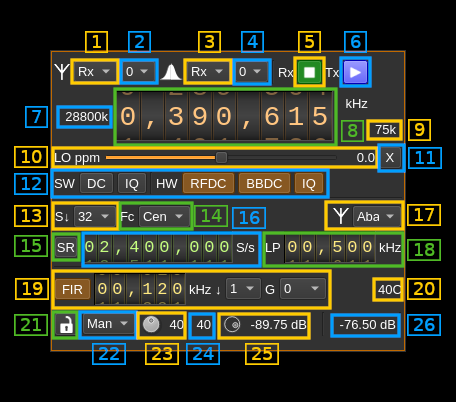
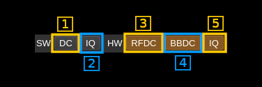
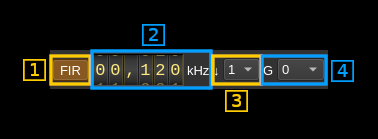

<h1>PlutoSDR MIMO plugin</h1>

<h2>Introduction</h2>


This MIMO plugin gets or sends its samples from/to a Pluto+ SDR device. This is an enhanced version of the [ADALM Pluto](https://wiki.analog.com/university/tools/pluto) from Analog Devices with which it shares firmware. The Pluto+ is available from well known Chinese on-line shops for electronics like AliExpress or Banggood.

The device comes configured for 2 Rx and 2 Tx but in case you change firmware you may need to re-activate the 2 Rx and 2 Tx option. You can apply a procedure similar to the one used to extend frequency range of the ADALM Pluto [here](https://wiki.analog.com/university/tools/pluto/devs/booting). Note that the compatibility is set to AD9361 and not AD9364. So the particular setup is the following:

```sh
# fw_setenv attr_name compatible
# fw_setenv attr_val ad9361
# fw_setenv attr_name mode
# fw_setenv attr_val 2r2t
```

&#9758; Similarly with ADALM Pluto when running the Pluto on Ethernet interface you have to create a non discoverable device reference in the [user arguments dialog](https://github.com/f4exb/rpx-100/blob/master/sdrgui/deviceuserargs.md) from the main window Preferences &gt; Devices menu. You must use the `PlutoSDR` hardware ID then specify the device address with a `uri` parameter in the user arguments for example: `uri=ip:192.168.1.10`. Note that this will become effective once rpx-100 is restarted.

<h2>Build</h2>

The plugin will be built only if libiio is installed in your system. To build and install libiio from source do:

  - `git clone https://github.com/analogdevicesinc/libiio.git`
  - `cd libiio`
  - `git checkout v0.10 # or latest stable release`
  - `mkdir build`
  - `cd build`
  - `cmake -DCMAKE_INSTALL_PREFIX=/opt/install/libiio -DINSTALL_UDEV_RULE=OFF ..`
  - `make -j8`
  - `make install`

Then add the following defines on `cmake` command line when compiling rpx-100:

`-DIIO_DIR=/opt/install/libiio`

<h2>Interface</h2>



<h3>1. Rx/Tx settings selection</h3>

Use this combo to target UI to Rx or Tx streams for Rx/Tx specific items.

<h3>2. Stream settings selection</h3>

Use this combo to target UI to stream 0 or stream 1 for stream specific items. These are settings (20) to (24).

<h3>3. Rx/Tx spectrum display selection</h3>

Use this combo to select Rx or Tx side for main spectrum display.

<h3>4. Stream spectrum display selection</h3>

Use this combo to select stream 0 or stream 1 for main spectrum display.

<h3>5. Start/Stop Rx</h3>

This button controls the start/stop of the Rx subsystem.

  - Blue triangle icon: device is ready and can be started
  - Green square icon: device is running and can be stopped
  - Magenta (or pink) square icon: an error occurred. In the case the device was accidentally disconnected you may click on the icon to stop, plug back in, check the source on the sampling devices control panel and start again.

<h3>6. Start/Stop Tx</h3>

This button controls the start/stop of the Tx subsystem.

  - Blue triangle icon: device is ready and can be started
  - Green square icon: device is running and can be stopped
  - Magenta (or pink) square icon: an error occurred. In the case the device was accidentally disconnected you may click on the icon to stop, plug back in, check the source on the sampling devices control panel and start again.

<h4>7: ADC sample rate</h4>

This is the sample rate at which the ADC runs in kS/s (k) or MS/s (M) before hardware decimation. Hardware decimation is only partially controlled by the user using the FIR decimation factor (12). The value here is the value returned by the device interface therefore it is always exact.

<h4>8: Frequency</h4>

This is the center frequency of reception in kHz. The limits are set as those of the AD9364: from 70 to 6000 MHz. PlutoSDR can be fooled to think it has a AD9364 chip with a very simple software hack described [here](https://wiki.analog.com/university/tools/pluto/users/customizing).

AD9363 extended frequency range is not guaranteed but would work normally particularly in the lower range.

<h4>9: Stream sample rate</h4>

In device to host sample rate input mode (8A) this is the baseband I/Q sample rate in kS/s. This is the device to host sample rate (8) divided by the software decimation factor (5).

In baseband sample rate input mode (8A) this is the device to host sample rate in kS/s. This is the baseband sample rate (8) multiplied by the software decimation factor (5)

<h3>10: LO ppm correction</h3>

Use this slider to adjust LO correction in ppm. It can be varied from -20.0 to 20.0 in 0.1 steps and is applied in hardware. This applies to the oscillator that controls both the Rx and Tx frequency therefore it is also changed on the Tx plugin if it is active.

<h3>11: Transverter mode open dialog</h3>

This button opens a dialog to set the transverter mode frequency translation options. The details about this dialog can be found [here](../../../sdrgui/gui/transverterdialog.md)

<h3>12: Auto correction options</h3>



<h4>12.1: DC<h4>

Software DSP auto correction: auto remove DC component

<h4>12.2: IQ</h4>

Software DSP auto correction: auto make I/Q balance. The DC correction must be enabled for this to be effective.

<h4>12.3: RFDC</h4>

Hardware AD9363 DC and I/Q compensation: RF DC correction

<h4>12.4: BBDC</h4>

Hardware AD9363 DC and I/Q compensation: Baseband DC correction

<h4>12.5: IQ</h4>

Hardware AD9363 DC and I/Q compensation: I/Q imbalance correction.

&#9758; There is a reason why you would like to remove any I/Q correction: this is for the reception of signals that are symmetric in I and Q (real signals). More details [here](https://wiki.analog.com/university/tools/pluto/users/non_quad) something not very well known about SDR and DSP.

<h3>13: Software decimation factor</h3>

The I/Q stream from the PlutoSDR is downsampled by a power of two by software inside the plugin before being sent to the passband. Possible values are increasing powers of two: 1 (no decimation), 2, 4, 8, 16, 32, 64.

<h3>14: Decimated bandpass center frequency position relative the the PlutoSDR Rx center frequency</h3>

  - **Cen**: the decimation operation takes place around the PlutoSDR Rx center frequency Fs
  - **Inf**: the decimation operation takes place around Fs - Fc.
  - **Sup**: the decimation operation takes place around Fs + Fc.

With SR as the sample rate before decimation Fc is calculated as:

  - if decimation n is 4 or lower:  Fc = SR/2^(log2(n)-1). The device center frequency is on the side of the baseband. You need a RF filter bandwidth at least twice the baseband.
  - if decimation n is 8 or higher: Fc = SR/n. The device center frequency is half the baseband away from the side of the baseband. You need a RF filter bandwidth at least 3 times the baseband.

<h3>15: Device to host sample rate / Baseband sample rate input toggle</h3>

Use this toggle button to switch the sample rate input next (8) between device to host sample rate and baseband sample rate input. The button shows the current mode:

  - **SR**: device sample rate input mode. The baseband sample rate (1.5) is the device to host sample rate (8) divided by the software decimation factor (5).
  - **BB**: baseband sample rate input mode. The device sample rate (1.5) is the baseband sample rate (8) multiplied by the software decimation factor (5).

<h3>16: Sample rate</h3>

This is the device to host sample rate or baseband sample rate in samples per second (S/s). The control (8) is used to switch between the two input modes.

The limits are adjusted automatically. In baseband input mode the limits are driven by the software decimation factor (5). You may need to increase this decimation factor to be able to reach lower values.

Use the wheels to adjust the sample rate. Pressing shift simultaneously moves digit by 5 and pressing control moves it by 2. Left click on a digit sets the cursor position at this digit. Right click on a digit sets all digits on the right to zero. This effectively floors value at the digit position. Wheels are moved with the mousewheel while pointing at the wheel or by selecting the wheel with the left mouse click and using the keyboard arrows.

The minimum sample rate depends on the hardware FIR decimation factor (13) and is the following:

  - no decimation: 25/12 MS/s thus 2083336 S/s (next multiple of 4)
  - decimation by 2: 25/24 MS/s thus 1041668 S/s
  - decimation by 4: 25/48 MS/s thus 520834 S/s

The maximum sample rate is fixed and set to 20 MS/s

<h3>17: Antenna (input) connection</h3>

The AD9363 has many port options however as only the A balanced input is connected you should leave it as the default. This is a provision for people who want to hack the board. The different values may be found in the AD9363 documentation.

<h3>18: Rx analog filter bandwidth</h3>

This is the Rx analog filter bandwidth in kHz in the AD9363 device. It can be varied from 200 kHz to 14 MHz in 1 kHz steps. Use the wheels to adjust the value. Pressing shift simultaneously moves digit by 5 and pressing control moves it by 2.

<h3>19: Hardware FIR filter settings</h3>

The AD9363 chip has optional FIR filters:

  - in the Rx decimation chain as the last decimation block.
  - in the Tx interpolation chain as the first interpolation block.



<h4>19.1: Hardware FIR filter toggle</h4>

Use this button to activate or deactivate the filter.

<h4>19.2: Hardware FIR filter bandwidth</h4>

Use the wheels to adjust the bandwidth of the hardware FIR filter. Pressing shift simultaneously moves digit by 5 and pressing control moves it by 2.

The filter limits are calculated as 0.05 and 0.9 times the FIR filter input frequency for the lower and higher limit respectively. The FIR filter input frequency is the baseband sample rate (5) multiplied by the FIR interpolation factor (9)

For bandwidths greater than 0.2 times the FIR filter input frequency the filter is calculated as a windowed FIR filter with a Blackman-Harris window. This has a high out of band rejection value at the expense of a slightly smoother roll off compared to other filters. The bandwidth value sets the -6 dB point approximately.

For bandwidths between 0.05 and 0.2 times the FIR filter input frequency the window used is a Hamming window giving a sharper transition.

<h4>19.3: Hardware FIR decimation/interpolation factor</h4>

The FIR filter block can provide a decimation or interpolation by 1 (no decimation), 2 or 4. This controls the minimum possible baseband sample rate as already discussed in (8).

<h4>19.4: Hardware FIR gain</h4>

The FIR filter can introduce a gain that can be set to -12, -6, 0 or 6 dB. The FIR has a fixed gain of 6 dB so to maximize dynamic range one would set the gain at -6 dB so that the overall gain is set at 0 dB.

<h3>20: Board temperature</h3>

This is the board temperature in degrees Celsius updated every ~5s.

<h3>21. Lock both streams gains</h3>

When engaged this applies the same gain controls (22, 23, 25) to both streams (Rx or Tx)

<h3>22: Rx gain mode</h3>

Use this combo to select between gain options:

  - **Man**: manual: the overall gain in dB can be set with the gain button (15)
  - **Slow**: slow AGC: gain button (15) is disabled
  - **Fast**: fast AGC: gain button (15) is disabled
  - **Hybr**: hybrid AGC: gain button (15) is disabled

See AD9363 documentation for details on AGC options.

<h3>23: Rx global manual gain</h3>

Use this button to adjust the global gain manually in manual gain mode. This button is disabled when AGC modes are selected with combo (15).

<h3>24: Actual Rx gain fetched from device</h3>

This is the actual gain in dB set in the device.

<h4>25: Tx attenuation</h4>

Use this button to adjust the attenuation. It can be varied from -89.75 to 0 dB in 0.25 dB steps.

<h3>26: Indicative RSSI</h3>

This is the indicative RSSI of the receiver.
