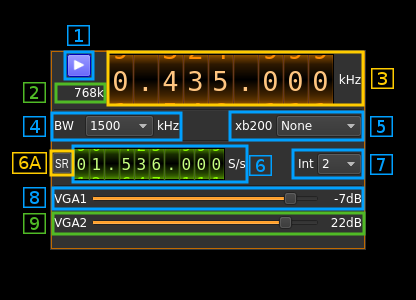
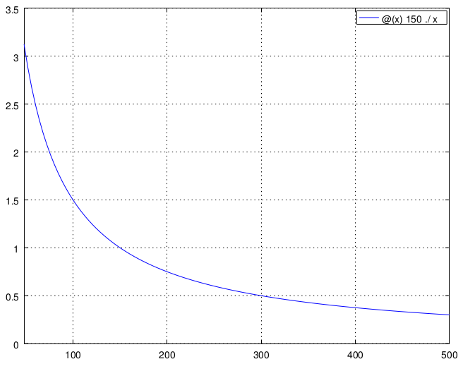

<h1>BladeRF classic (v1) output plugin</h1>

<h2>Introduction</h2>

This output sample sink plugin sends its samples to a [BladeRF1 device](https://www.nuand.com/bladerf-1).

Warning to Windows users: concurrent use of Rx and Tx does not work correctly hence full duplex is not fully operational. For best results use BladeRF as a half duplex device like HackRF i.e. do not run Tx and Rx concurrently. Anyway from version 4.2.0 using LibbladeRF v.2 this is available in Linux distributions only.

SoapySDR devices appear in the list of available devices in the order they are listed by the API call to SoapySDR. If more than one device controlled by SoapySDR is listed then its sequence number is incremented like:

<pre>
SoapySDR[0:0] Generic RTL... 
SoapySDR[1:0] Generic RTL...
</pre>

If the same device exposes several channels they appear as distinct devices with the channel number incremented like:

<pre>
SoapySDR[1:0] LimeSDR... 
SoapySDR[1:1] LimeSDR...
</pre>

This works similarly to LimeSDR USB or BladeRF 2.0 micro

<h2>Build</h2>

The plugin will be built only if the [BladeRF host library](https://github.com/Nuand/bladeRF) is installed in your system. If you build it from source and install it in a custom location say: `/opt/install/libbladeRF` you will have to add `-DBLADERF_INCLUDE_DIR=/opt/install/libbladeRF` to the cmake command line.

Note that libbladeRF v2 with git tag 2018.10-rc1 should be used (official release) thus:

  - The FX3 firmware version should be v2.3.1
  - The FPGA image version should be v0.9.0

The FPGA .rbf file should be copied to the folder where the `sdrangel` binary resides. You can download FPGA images from [here](https://www.nuand.com/fpga_images/)

The BladeRF Host library is also provided by many Linux distributions (check its version) and is built in the SDRangel binary releases.

<h2>Interface</h2>

<h3>1: Start/Stop</h3>

Device start / stop button.

  - Blue triangle icon: device is ready and can be started
  - Red square icon: device is running and can be stopped
  - Magenta (or pink) square icon: an error occurred. In the case the device was accidentally disconnected you may click on the icon, plug back in and start again.

<h3>2: Stream sample rate</h3>

In host to device sample rate input mode (6A) this is the baseband I/Q sample rate in kS/s. This is the host to device sample rate (6) divided by the interpolation factor (7).

In baseband sample rate input mode (6A) this is the host to device sample rate in kS/s. This is the baseband sample rate (6) multiplied by the software interpolation factor (7)

Transmission latency depends essentially in the delay in the sample FIFO. The FIFO size is calculated as follows:

For interpolation by 32 the size is fixed at 150000 samples, Delay is 150000 / B where B is the baseband sample rate. Below is the delay in seconds vs baseband sample rate in kS/s from 48 to 500 kS/s:

For lower interpolation rates the size is calculated to give a fixed delay of 250 ms or 75000 samples whichever is bigger. Below is the delay in seconds vs baseband sample rate in kS/s from 48 to 400 kS/s. The 250 ms delay is reached at 300 kS/s:

<h3>3: Frequency</h3>

This is the center frequency of transmission in kHz.

<h3>4: Tx filter bandwidth</h3>

This is the Tx filter bandwidth in kHz in the LMS6002D device. Possible values are: 1500, 1750, 2500, 2750, 3000, 3840, 5000, 5500, 6000, 7000, 8750, 10000, 12000, 14000, 20000, 28000 kHz.

<h3>5: XB-200 add-on control</h3>

This controls the optional XB-200 add-on when it is fitted to the BladeRF main board. These controls have no effect if the XB-200 board is absent. Options are:

  - **None**: XB-200 is ignored
  - **Bypass**: XB-200 is passed through
  - **Auto 1dB**: The 50, 144 and 220 MHz filters are switched on automatically according to the frequency of reception when it is within the -1 dB passband of the filters
  - **Auto 3dB**: The 50, 144 and 220 MHz filters are switched on automatically according to the frequency of reception when it is within the -3 dB passband of the filters
  - **Custom**: The signal is routed through a custom filter
  - **50M**: The signal is routed through the 50 MHz filter
  - **144M**: The signal is routed through the 144 MHz filter
  - **222M**: The signal is routed through the 222 MHz filter

<h3>6A: Host to device sample rate / Baseband sample rate input toggle</h3>

Use this toggle button to switch the sample rate input next (6) between host to device sample rate and baseband sample rate input. The button shows the current mode:

  - **SR**: host to device sample rate input mode. The baseband sample rate (2) is the host to device sample rate (6) divided by the interpolation factor (7).
  - **BB**: baseband sample rate input mode. The host to device sample rate (2) is the baseband sample rate (6) multiplied by the interpolation factor (7).

<h3>6: Sample rate</h3>

This is the BladeRF device DAC sample rate or baseband sample rate in samples per second (S/s). The control (6A) is used to switch between the two input modes. The device to/from host stream sample rate is the same for the Rx and Tx systems.

The limits are adjusted automatically. In baseband input mode the limits are driven by the interpolation factor (7). You may need to increase this interpolation factor to be able to reach lower values.

Use the wheels to adjust the sample rate. Left click on a digit sets the cursor position at this digit. Right click on a digit sets all digits on the right to zero. This effectively floors value at the digit position. Wheels are moved with the mousewheel while pointing at the wheel or by selecting the wheel with the left mouse click and using the keyboard arrows. Pressing shift simultaneously moves digit by 5 and pressing control moves it by 2.

<h3>7: Interpolation factor</h3>

The baseband stream is interpolated by this value before being sent to the BladeRF device. Possible values are:

  - **1**: no interpolation
  - **2**: multiply baseband stream sample rate by 2
  - **4**: multiply baseband stream sample rate by 4
  - **8**: multiply baseband stream sample rate by 8
  - **16**: multiply baseband stream sample rate by 16
  - **32**: multiply baseband stream sample rate by 32

The main samples buffer is based on the baseband sample rate and will introduce ~500ms delay for interpolation by 16 or lower and ~1s for interpolation by 32.

<h3>8: Variable gain amplifier #1 gain</h3>

The VGA1 (relative) gain can be adjusted from -35 dB to -4 dB in 1 dB steps. The VGA1 is inside the LMS6002D chip and is placed between the baseband filter and the RF mixer.

<h3>9: Variable gain amplifier #2 gain</h3>

The VGA2 gain can be adjusted from 0 dB to 25 dB in 1 dB steps. The VGA2 is inside the LMS6002D chip and is placed after the RF mixer. It can be considered as the PA (Power Amplifier). The maximum output power when both VGA1 and VGA2 are at their maximum is about 4 mW (6 dBm).
