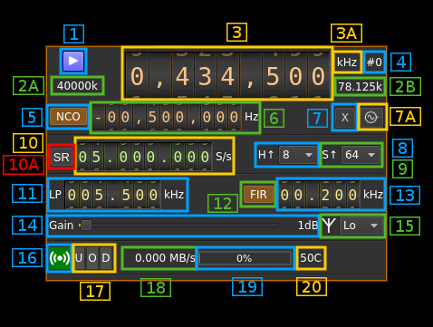
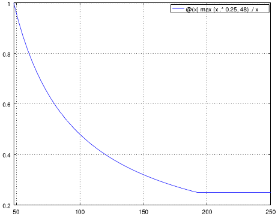
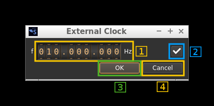

<h1>LimeSDR output plugin</h1>

<h2>Introduction</h2>

This output sample sink plugin sends its samples to a [LimeSDR device](https://myriadrf.org/projects/limesdr/).

&#9888; Version 18.04.1 of LimeSuite is used in the buildsand corresponding gateware loaded in the LimeSDR should be is used (2.16 for LimeSDR-USB and 1.24 for LimeSDR-Mini). If you compile from source version 18.04.1 of LimeSuite must be used.

&#9888; LimeSDR-Mini seems to have problems with Zadig driver therefore it is supported in Linux only.

LimeSDR is a 2x2 MIMO device so it has two transmitting channels that can run concurrently. To activate the second channel when the first is already active just open a new sink tab in the main window (Devices -> Add sink device) and select the same LimeSDR device.

<h2>Build</h2>

The plugin will be built only if LimeSuite is installed in your system. Please use version tagged v17.06.0 or maybe later. To build and install LimeSuite from source do:

  - `git clone https://github.com/myriadrf/LimeSuite.git`
  - `cd LimeSuite`
  - `mkdir builddir`
  - `cd builddir`
  - `cmake -DCMAKE_INSTALL_PREFIX=/opt/install/LimeSuite`
  - `make -j8`
  - `make install`

Then add the following defines on `cmake` command line:

`-DLIMESUITE_DIR=/opt/install/LimeSuite`

<h2>Installation from binary packages</h2>

&#9758; LimeSuite is built in the binary packages so there is no external dependency

<h2>Interface</h2>

<h3>1: Start/Stop</h3>

Device start / stop button.

  - Blue triangle icon: device is ready and can be started
  - Green square icon: device is running and can be stopped
  - Magenta (or pink) square icon: an error occurred. In the case the device was accidentally disconnected you may click on the icon to stop, plug back in, check the source on the sampling devices control panel and start again.

<h3>2A: DAC sample rate</h3>

This is the sample rate at which the DAC runs in kS/s (k) or MS/s (M) after hardware interpolation (8). Thus this is the host to device sample rate (10) multiplied by the hardware interpolation factor (8).

&#9758; Note that changing the hardware interpolation factor (8) or the host to device sample rate (10) may change the ADC clock sample rate and therefore the Rx side hardware decimation factor and/or device to host sample rate. In fact ADC and DAC sample rates can be equal or related by a factor of 2.

<h3>2B: Stream sample rate</h3>

In host to device sample rate input mode (10A) this is the baseband I/Q sample rate in kS/s. This is the host to device sample rate (10) divided by the software interpolation factor (9).

In baseband sample rate input mode (10A) this is the host to device sample rate in kS/s. This is the baseband sample rate (10) multiplied by the software interpolation factor (9)

Transmission latency depends essentially in the delay in the sample FIFO. The size of sample FIFO is calculated to give a fixed delay of 250 ms or 48000 samples whichever is bigger. Below is the delay in seconds vs baseband sample rate in kS/s from 48 to 250 kS/s. The 250 ms delay is reached at 192 kS/s:

<h3>3: Center frequency</h3>

This is the center frequency of transmission in kHz.

<h3>3A: Center frequency units</h3>

This is the center frequency units thus kHz (fixed)

<h3>4: Channel number</h3>

LimeSDR is a 2x2 MIMO device so it has two transmitting channels. This shows the corresponding Tx channel index (0 or 1).

<h3>5: NCO toggle</h3>

The button is lit when NCO is active and dark when inactive.

Use this button to activate/deactivate the TSP NCO. The LMS7002M chip has an independent NCO in each Tx channel that can span the bandwidth sent to the DAC. This effectively allows non zero digital IF.

<h3>6: NCO frequency shift</h3>

This is the frequency shift applied when the NCO is engaged thus the actual LO frequency is the center frequency of transmission minus this value. Use the thumbwheels to adjust frequency as done with the LO (1.1). Pressing shift simultaneously moves digit by 5 and pressing control moves it by 2. The boundaries are dynamically calculated from the LO center frequency, sample rate and hardware interpolation factor.

&#9758; In the LMS7002M TSP block the NCO sits after the interpolator (see Fig.14 of the [datasheet](http://www.limemicro.com/wp-content/uploads/2015/09/LMS7002M-Data-Sheet-v2.8.0.pdf) p.7) so it runs at the actual DAC rate. Hence the NCO limits are calculated as +/- half the device to host sample rate multiplied by the hardware interpolation factor. For example with a 4 MS/s device to host sample rate (10) and a hardware interpolation of 16 (8) you have +/- 32 MHz span around the LO for the NCO. In this example you can tune all HF frequencies with the center frequency set at its lowest (30 MHz).

<h3>7: Transverter mode open dialog</h3>

This button opens a dialog to set the transverter mode frequency translation options:

Note that if you mouse over the button a tooltip appears that displays the translating frequency and if translation is enabled or disabled. When the frequency translation is enabled the button is lit.

<h4>7.1: Translating frequency</h4>

You can set the translating frequency in Hz with this dial. Use the wheels to adjust the sample rate. Left click on a digit sets the cursor position at this digit. Right click on a digit sets all digits on the right to zero. This effectively floors value at the digit position. Wheels are moved with the mousewheel while pointing at the wheel or by selecting the wheel with the left mouse click and using the keyboard arrows. Pressing shift simultaneously moves digit by 5 and pressing control moves it by 2.

The frequency set in the device is the frequency on the main dial (1) minus this frequency. Thus it is positive for down converters and negative for up converters.

For example a mixer at 120 MHz for HF operation you would set the value to -120,000,000 Hz so that if the main dial frequency is set at 7,130 kHz the PlutoSDR will be set to 127.130 MHz.

If you use a down converter to receive the 6 cm band narrowband center frequency of 5670 MHz at 432 MHz you would set the translating frequency to 5760 - 432 = 5328 MHz thus dial +5,328,000,000 Hz.

For bands even higher in the frequency spectrum the GHz digits are not really significant so you can have them set at 1 GHz. Thus to receive the 10368 MHz frequency at 432 MHz you would set the translating frequency to 1368 - 432 = 936 MHz. Note that in this case the frequency of the LO used in the mixer of the transverter is set at 9936 MHz.

The Hz precision allows a fine tuning of the transverter LO offset

<h4>7.2: Translating frequency enable/disable</h4>

Use this toggle button to activate or deactivate the frequency translation

<h4>7.3: Confirmation buttons</h4>

Use these buttons to confirm ("OK") or dismiss ("Cancel") your changes.

<h3>7A: External clock control</h3>

Use this button to open a dialog that lets you choose the external clock frequency and enable or disable it. When disabled the internal 30.72 MHz VCTCXO is used.

<h4>7A.1: External clock frequency</h4>

Can be varied from 5 to 300 MHz

Use the thumbwheels to adjust frequency as done with the LO (1.1). Pressing shift simultaneously moves digit by 5 and pressing control moves it by 2. The boundaries are dynamically calculated from the LO center frequency, sample rate and hardware decimation factor.

<h4>7A.2: Enable/disable external clock input</h7A>

Use this checkbox to enable or disable the external clock input

<h4>7A.3: Confirm changes</h4>

Use the "OK" button to confirm your changes

<h4>7A.4: Dismiss changes</h4>

Use the "Cancel" button to dismiss your changes

<h3>8: LMS7002M hardware interpolation factor</h3>

The TSP block in the LMS7002M hardware has an interpolation chain that acts on both Tx channels. It is composed of 5 halfband interpolation stages and therefore can achieve interpolation between 1 (no interpolation) and 32 in increasing powers of 2: 1, 2, 4, 8, 16, 32.

Thus the actual sample rate of the DAC is the stream sample rate (10) multiplied by this factor. In the screenshot example this yields a 40 MS/s rate at the DAC.

<h3>9: Software interpolation factor</h3>

The I/Q stream from the baseband is upsampled by a power of two by software inside the plugin before being sent to the LimeSDR device. Possible values are increasing powers of two: 1 (no interpolation), 2, 4, 8, 16, 32.

<h3>10A: Host to device sample rate / Baseband sample rate input toggle</h3>

Use this toggle button to switch the sample rate input next (10) between host to device sample rate and baseband sample rate input. The button shows the current mode:

  - **SR**: host to device sample rate input mode. The baseband sample rate (2B) is the host to device sample rate (10) divided by the software interpolation factor (9).
  - **BB**: baseband sample rate input mode. The host to device sample rate (2B) is the baseband sample rate (8) multiplied by the software interpolation factor (9).

<h3>10: Sample rate</h3>

This is the LMS7002M device to/from host stream sample rate or baseband sample rate in samples per second (S/s). The control (10A) is used to switch between the two input modes. The device to/from host stream sample rate is the same for the Rx and Tx systems.

The limits are adjusted automatically. In baseband input mode the limits are driven by the software interpolation factor (9). You may need to increase this interpolation factor to be able to reach lower values.

This is the LMS7002M device to/from host stream sample rate in S/s. It is the same for the Rx and Tx systems.

Use the wheels to adjust the sample rate. Pressing shift simultaneously moves digit by 5 and pressing control moves it by 2. Left click on a digit sets the cursor position at this digit. Right click on a digit sets all digits on the right to zero. This effectively floors value at the digit position. Wheels are moved with the mousewheel while pointing at the wheel or by selecting the wheel with the left mouse click and using the keyboard arrows.

The LMS7002M uses the same clock for both the ADCs and DACs therefore this sample rate affects all of the 2x2 MIMO channels.

<h3>11: Tx hardware filter bandwidth</h3>

This is the Tx hardware filter bandwidth in kHz in the LMS7002M device for the given channel. Boundaries are updated automatically but generally are from 5 to 130 MHz in 1 kHz steps. Use the wheels to adjust the value. Pressing shift simultaneously moves digit by 5 and pressing control moves it by 2.

<h3>12: TSP FIR filter toggle</h3>

The TSP in the LMS7002M chip has a FIR filter chain per channel. Use this button to activate or deactivate the TSP FIR filter.

<h3>13: TSP FIR filter bandwidth</h3>

Use the wheels to adjust the bandwidth of the hardware TSP FIR filter. Pressing shift simultaneously moves digit by 5 and pressing control moves it by 2.

<h3>14: Gain</h2>

Use this slider to adjust the global gain of the Tx chain. LimeSuite software automatically set optimal values of the amplifiers to achieve this global gain. This gain can be set between 0 and 70 dB in 1 dB steps. The value in dB appears at the right of the slider.

<h3>15: Antenna selection</h3>

  - ** No **: no output
  - ** Lo **: Tx low range 30 MHz to 1.9 GHz
  - ** Hi **: Tx high range: 2 GHz and above

<h3>16: Stream status indicator</h3>

This label turns green when status can be obtained from the current stream. Usually this means that the stream is up and running but not necessarily streaming data. The various status elements appear next on the same line (16, 17, 18)

<h3>17: Stream warning indicators</h3>

  - **U**: turns red if stream experiences underruns
  - **O**: turns red if stream experiences overruns
  - **P**: turns red if stream experiences packet drop outs

<h3>18: Stream global (all Tx) throughput in MB/s</h3>

This is the stream throughput in MB/s and is usually about 3 times the sample rate for a single stream and 6 times for a dual Tx stream. This is due to the fact that 12 bits samples are used and although they are represented as 16 bit values only 12 bits travel on the USB link.

<h3>19: FIFO status</h3>

This is the fill percentage of the Tx FIFO in the LimeSuite interface. In normal conditions this should be ~100%. On the picture the Tx is not started.

<h3>20: Board temperature</h3>

This is the board temperature in degrees Celsius updated every ~5s. Before the first probe the display marks "00C" this is normal.
