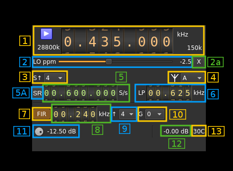
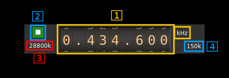

<h1>PlutoSDR output plugin</h1>

<h2>Introduction</h2>

This output sample sink plugin sends its samples to a [PlutoSDR device](https://wiki.analog.com/university/tools/pluto). This is also known as the ADALM-Pluto. ADALM stands for Analog Devices Active Learning Module and is targeting students in electrical engineering and digital signal processing. Of course it can be used as a radio device like any other SDR.

&#9758; PlutoSDR is physically implemented as a 1x1 SISO device although the AD9363 chip does have a second Rx and a second Tx channel. Revision C of the board claims to have pads to allow hackers connecting the second ports externally however for now only the first Tx channel is supported by this plugin.

&#9758; When running the Pluto on Ethernet interface you have to create a non discoverable device reference in the [user arguments dialog](https://github.com/f4exb/sdrangel/blob/master/sdrgui/deviceuserargs.md) from the main window Preferences &gt; Devices menu. You must use the `PlutoSDR` hardware ID then specify the device address with a `uri` parameter in the user arguments for example: `uri=ip:192.168.1.10`. Note that this will become effective once SDRangel is restarted.

<h2>Build</h2>

The plugin will be built only if libiio is installed in your system. To build and install libiio from source do:

  - `git clone https://github.com/analogdevicesinc/libiio.git`
  - `cd libiio`
  - `git checkout v0.10 # or latest stable release`
  - `mkdir build`
  - `cd build`
  - `cmake -DCMAKE_INSTALL_PREFIX=/opt/install/libiio -DINSTALL_UDEV_RULE=OFF ..`
  - `make -j8`
  - `make install`

Then add the following defines on `cmake` command line when compiling SDRangel:

`-DIIO_DIR=/opt/install/libiio`

<h2>Interface</h2>

<h3>1: Common stream parameters</h3>

<h4>1.1: Frequency</h4>

This is the center frequency of transmission in kHz. The limits are set as those of the AD9364: from 70 to 6000 MHz. PlutoSDR can be fooled to think it has a AD9364 chip with a very simple software hack described [here](https://wiki.analog.com/university/tools/pluto/users/customizing).

AD9363 extended frequency range is not guaranteed but would work normally particularly in the lower range.

<h4>1.2: Start/Stop</h4>

Device start / stop button.

  - Blue triangle icon: device is ready and can be started
  - Green square icon: device is running and can be stopped
  - Magenta (or pink) square icon: an error occurred. In the case the device was accidentally disconnected you may click on the icon to stop, plug back in, check the source on the sampling devices control panel and start again.

<h4>1.3: DAC sample rate</h4>

This is the sample rate at which the DAC runs in kS/s (k) or MS/s (M) after hardware interpolation. Hardware interpolation is only partially controlled by the user using the FIR interpolation factor (9). The value here is the value returned by the device interface therefore it is always exact.

<h3>1.4: Stream sample rate</h3>

In host to device sample rate input mode (5A) this is the baseband I/Q sample rate in kS/s. This is the host to device sample rate (5) divided by the software interpolation factor (3).

In baseband sample rate input mode (5A) this is the host to device sample rate in kS/s. This is the baseband sample rate (5) multiplied by the software interpolation factor (3)

<h3>2: LO ppm correction</h3>

Use this slider to adjust LO correction in ppm. It can be varied from -20.0 to 20.0 in 0.1 steps and is applied in hardware. This applies to the oscillator that controls both the Tx and Rx frequency therefore it is also changed on the Rx plugin if it is active.

<h3>2a: Transverter mode open dialog</h3>

This button opens a dialog to set the transverter mode frequency translation options:

Note that if you mouse over the button a tooltip appears that displays the translating frequency and if translation is enabled or disabled. When the frequency translation is enabled the button is lit.

<h4>2a.1: Translating frequency</h4>

You can set the translating frequency in Hz with this dial. Use the wheels to adjust the sample rate. Left click on a digit sets the cursor position at this digit. Right click on a digit sets all digits on the right to zero. This effectively floors value at the digit position. Wheels are moved with the mousewheel while pointing at the wheel or by selecting the wheel with the left mouse click and using the keyboard arrows. Pressing shift simultaneously moves digit by 5 and pressing control moves it by 2.

The frequency set in the device is the frequency on the main dial (1) minus this frequency. Thus it is positive for up converters and negative for down converters.

For example with a mixer at 120 MHz for HF operation you would set the value to -120,000,000 Hz so that if the main dial frequency is set to 7,130 kHz the PlutoSDR will be set to 127.130 MHz.

If you use an up converter to transmit at the 6 cm band narrowband center frequency of 5670 MHz with the PlutoSDR set at 432 MHz you would set the translating frequency to 5760 - 432 = 5328 MHz thus dial +5,328,000,000 Hz.

For bands even higher in the frequency spectrum the GHz digits are not really significant so you can have them set at 1 GHz. Thus to transmit at the 10368 MHz frequency with 432 MHz for the PlutoSDR you would set the translating frequency to 1368 - 432 = 936 MHz. Note that in this case the frequency of the LO used in the mixer of the transverter is set at 9936 MHz.

The Hz precision allows a fine tuning of the transverter LO offset

<h4>2a.2: Translating frequency enable/disable</h4>

Use this toggle button to activate or deactivate the frequency translation

<h4>2a.3: Confirmation buttons</h4>

Use these buttons to confirm ("OK") or dismiss ("Cancel") your changes.

<h3>3: Software interpolation factor</h3>

The I/Q stream to the PlutoSDR is upsampled by a power of two by software inside the plugin from the signal coming from the passband. Possible values are increasing powers of two: 1 (no interpolation), 2, 4, 8, 16, 32.

<h3>4: Antenna (output) connection</h3>

The AD9363 has many port options however as only the A output is connected you should leave it as the default. This is a provision for people who want to hack the board. The different values may be found in the AD9363 documentation.

<h3>5A: Host to device sample rate / Baseband sample rate input toggle</h3>

Use this toggle button to switch the sample rate input next (5) between host to device sample rate and baseband sample rate input. The button shows the current mode:

  - **SR**: host to device sample rate input mode. The baseband sample rate (1.4) is the host to device sample rate (5) divided by the software interpolation factor (3).
  - **BB**: baseband sample rate input mode. The host to device sample rate (1.4) is the baseband sample rate (5) multiplied by the software interpolation factor (3).

<h3>5: Sample rate</h3>

This is the device to/from host stream sample rate or baseband sample rate in samples per second (S/s). The control (5A) is used to switch between the two input modes. The device to/from host stream sample rate is the same for the Rx and Tx systems.

The limits are adjusted automatically. In baseband input mode the limits are driven by the software interpolation factor (3). You may need to increase this interpolation factor to be able to reach lower values.

Use the wheels to adjust the sample rate. Pressing shift simultaneously moves digit by 5 and pressing control moves it by 2. Left click on a digit sets the cursor position at this digit. Right click on a digit sets all digits on the right to zero. This effectively floors value at the digit position. Wheels are moved with the mousewheel while pointing at the wheel or by selecting the wheel with the left mouse click and using the keyboard arrows.

The minimum sample rate depends on the hardware FIR decimation factor (9) and is the following:

  - no decimation: 25/12 MS/s thus 2083336 S/s (next multiple of 4)
  - decimation by 2: 25/24 MS/s thus 1041668 S/s
  - decimation by 4: 25/48 MS/s thus 520834 S/s

The maximum sample rate is fixed and set to 20 MS/s

<h3>6: Tx analog filter bandwidth</h3>

This is the Tx analog filter bandwidth in kHz in the AD9363 device. It can be varied from 625 kHz to 16 MHz in 1 kHz steps. Use the wheels to adjust the value. Pressing shift simultaneously moves digit by 5 and pressing control moves it by 2.

<h3>7: Hardware FIR filter toggle</h3>

The AD9363 chip has an optional FIR filter in the Tx interpolation chain as the first interpolation block. Use this button to activate or deactivate the filter.

The FIR filter settings are the same on Rx and Tx side therefore any change here is automatically forwarded to the Rx GUI.

<h3>8: Hardware FIR filter bandwidth</h3>

Use the wheels to adjust the bandwidth of the hardware FIR filter. Pressing shift simultaneously moves digit by 5 and pressing control moves it by 2.

The filter limits are calculated as 0.05 and 0.9 times the FIR filter input frequency for the lower and higher limit respectively. The FIR filter input frequency is the baseband sample rate (5) multiplied by the FIR interpolation factor (9)

For bandwidths greater than 0.2 times the FIR filter input frequency the filter is calculated as a windowed FIR filter with a Blackman-Harris window. This has a high out of band rejection value at the expense of a slightly smoother roll off compared to other filters. The bandwidth value sets the -6 dB point approximately.

For bandwidths between 0.05 and 0.2 times the FIR filter input frequency the window used is a Hamming window giving a sharper transition.

<h3>9: Hardware FIR interpolation factor</h3>

The FIR filter block can provide an interpolation by 1 (no interpolation), 2 or 4. This controls the minimum possible baseband sample rate as already discussed in (5).

<h3>10: Hardware FIR gain</h3>

The FIR filter can introduce a gain that can be set to -6 or 0 dB.

<h4>11: Attenuation</h4>

Use this button to adjust the attenuation. It can be varied from -89.75 to 0 dB in 0.25 dB steps.

<h4>12: Indicative RSSI</h4>

This is the indicative RSSI of the transmitter. It works only when the Rx is in monitor mode set with the control (7) of the input plugin.

<h3>13: Board temperature</h3>

This is the board temperature in degrees Celsius updated every ~5s.
