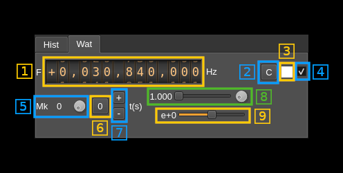

<h1>Spectrum markers management</h1>

The spectrum markers are controlled with this dialog. Note that spectrum markers will effectively show on the spectrum display only when it is active (shows some data).

<h2>General interface</h2>

<h3>1. Sub-dialog selection</h3>

The complete dialog is split into tabs:

  - **Hist** for histogram (spectrum line) markers
  - **Wat** for waterfall markers

<h3>2. Markers set selection</h3>

This lets you selects which markers are displayed

  - **None**: no markers are displayed
  - **Spec**: spectrum markers are displayed

<h2>Histogram markers tab</h2>

<h3>1. Marker frequency</h3>

Use this frequency dial to set the marker frequency in Hz

<h3>2. Center marker frequency</h3>

Push this button to move the marker at the center of the spectrum

<h3>3. Marker color</h3>

The marker color is displayed here. You can click on the square to open a standard color selection dialog to select the marker color. Note that it selects the color of the text display of the marker the crosshairs remain in white color.

<h3>4. Marker show</h3>

Toggles marker display on the spectrum

<h3>5. Marker selection</h3>

Turn the dial button to select the marker being set up. The index of the marker appears at left.

<h3>6. Swap marker with reference marker (index 0)<h3>

Push this button to swap the current marker with marker at index 0. The marker at index 0 is the reference marker. Note that the colors are not swapped so that the marker color is associated to its index and not the marker itself.

<h3>7. Add/Remove marker</h3>

  - Press the "+" button to add a new marker with a maximum of 4 markers.
  - Press the "-" button to remove the current marker. When reference marker (index 0) is removed the marker at index 1 if it exists replaces it and thus is made the reference marker.

<h3>8. Power hold reset</h3>

When the power max hold is selected (9) this button resets the max hold

<h3>9. Marker type</h3>

This combo lets you select the type of marker:

  - **Man**: manual power set. The value is set with the next control (10)
  - **Cur**: current power. The marker will move according to the current power at the marker frequency
  - **Max**: max hold. The marker will move according to the maximum power at the marker frequency. Use button (8) to reset.

<h3>10. Manual (fixed) power</h3>

Use this slider to adjust the power position of the marker. The units are in dB irrespective of the linear or log set of the spectrum display.

<h2>Waterfall markers tab</h2>

<h3>1. Marker frequency</h3>

Use this frequency dial to set the marker frequency in Hz

<h3>2. Center marker frequency</h3>

Push this button to move the marker at the center of the spectrum

<h3>3. Marker color</h3>

The marker color is displayed here. You can click on the square to open a standard color selection dialog to select the marker color. Note that it selects the color of the text display of the marker the crosshairs remain in white color.

<h3>4. Marker show</h3>

Toggles marker display on the spectrum

<h3>5. Marker selection</h3>

Turn the dial button to select the marker being set up. The index of the marker appears at left.

<h3>6. Swap marker with reference marker (index 0)<h3>

Push this button to swap the current marker with marker at index 0. The marker at index 0 is the reference marker. Note that the colors are not swapped so that the marker color is associated to its index and not the marker itself.

<h3>7. Add/Remove marker</h3>

  - Press the "+" button to add a new marker with a maximum of 4 markers.
  - Press the "-" button to remove the current marker. When reference marker (index 0) is removed the marker at index 1 if it exists replaces it and thus is made the reference marker.

<h3>8. Time mantissa</h3>

The time mark of the marker is given in seconds by mantissa M and exponent E so that t(s) = M &times; 10E. This part controls the mantissa component M that appears on the left. The slider lets you control the decimal part from .000 to .999 and the dial button the integer part from 0 to 9.

<h3>9. Time exponent</h3>

This slider lets you control the exponent part E of the time mark so that t(s) = M &times; 10E. The value in exponential notation appears on the left.
